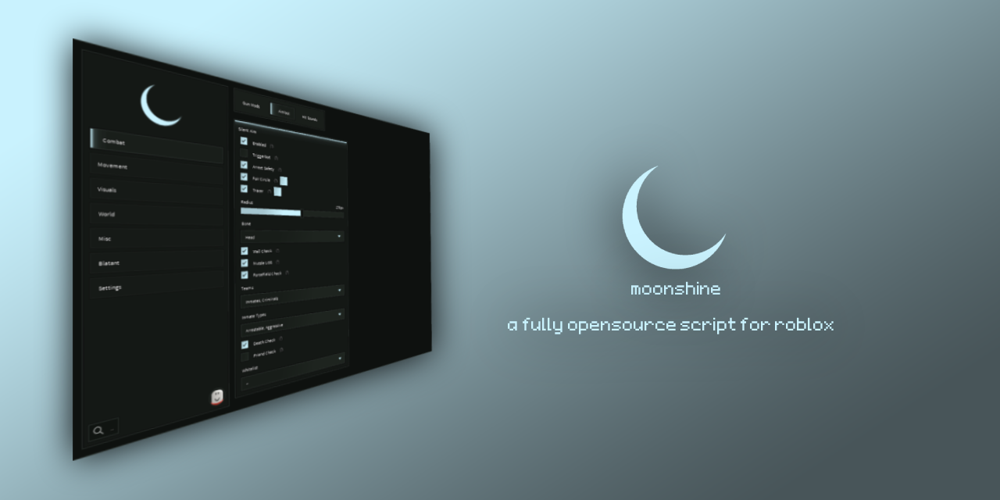

<div align='center'>

---



[discord](https://discord.gg/DPBtncwaEm)

---

## 🎮 supported games
| game name | place id | lines of code |
| --- | --- | --- |
| prison life | 155615604 | ~4000 |

## 💻 recommended executors
| executor | sunc | price |
| --- | --- | --- |
| volt | 98% | 6$/wk |
| seliware | 100% | 10$/mo |
| potASSium | 100% | 20$/lf |
| madium | null | free |

<details>
<summary>📦 script</summary>

```lua
loadstring(game:HttpGet("https://github.com/catthatdrinkssprite/moonshine/raw/main/loader.lua", true))()
```

</details>

---

<details>
<summary>🔫 prison life</summary>

### combat

<details>
<summary>gun mods</summary>

- **no fire rate** — removes fire rate delay on all guns
- **no spread** — zeroes out bullet spread on all guns
- **force auto fire** — forces all guns to fire automatically
- event-driven: mods apply instantly on enable/equip, revert to original values on disable

</details>

<details>
<summary>aimbot</summary>

- **silent aim** — hooks raycast to redirect bullets to the closest target
  - **triggerbot** — automatically fires when a valid target is within the fov circle (ranged weapons only)
  - fov circle and tracer with configurable colors
  - configurable radius, bone selection (head / humanoidrootpart)
  - wall check (respects removed doors server-side), death check, forcefield check
  - team and inmate type filters (guards, inmates, criminals / regular, aggressive, arrestable)
  - friend check with player whitelist dropdown

</details>

<details>
<summary>hit sounds</summary>

- **hit sounds** — plays a custom sound when you deal damage to another player
  - sound selection: rust, minecraft orb
  - configurable volume (0-3)
  - mute gun sound toggle — silences the default gun shoot sound
  - preview button to audition sounds without shooting
- **kill sounds** — plays a custom sound when you kill another player
  - independent sound selection and volume from hit sounds
  - preview button

</details>

### movement

- **noclip** — walk through walls and objects
- **infinite jump** — jump mid-air without limits

### visuals

<details>
<summary>esp</summary>

- **filters** — filter by team and inmate type, whitelist specific players (hide esp or show green)
- **name esp** — floating names above players with team color, inmate status prefixes ([A] / [W]), forcefield prefix ([FF]), outline
- **box esp** — 2d bounding boxes around players with team color, outline
- both esp types instantly hide on player death

</details>

### world

- **remove doors** — removes all doors from the map (reversible)

### misc

- **ping warning** — toggleable notification when ping exceeds 300ms (30s cooldown)
- **remove jump cooldown** — disables the anti-jump cooldown script
- **always backpack** — keeps the backpack enabled even when crouching or tased
- **anti invisible** — detects and stops the invisibility animation, highlights invisible players in red
- **anti tase** — counteracts taser effects by stopping stun animations and restoring movement
  - preserves sprint speed — restores your actual speed before being tased instead of defaulting to walk
- **arrest aura** — automatically arrests nearby criminals, aggressive and arrestable inmates
  - configurable radius (5-30 studs)
  - 3d radius circle rendered at feet level
  - 3d target line from your feet to the current target
  - friend check and player whitelist
- **fist aura** — automatically punches nearby players
  - configurable radius (5-30 studs)
  - team and inmate type filters (guards, inmates, criminals / regular, aggressive, arrestable)
  - 3d radius circle rendered at feet level
  - 3d target line from your feet to the current target
  - friend check and player whitelist
- **anti riot shield** — removes riot shield parts from all players' characters

### blatant

- **ragebot** — fully automated combat — acquires targets, aims, and fires with no input needed
  - automatically switch weapons if current one is empty
  - automatically reload weapons if the current ones magazine is empty
  - wall check (respects removed doors server-side), death check, forcefield check
  - team and inmate type filters (guards, inmates, criminals / regular, aggressive, arrestable)
  - friend check with player whitelist dropdown

### players

- **teleportation** — teleports to any selected player

### watermark

- **live stats** — watermark displays real-time fps and ping

</details>

---

### ⚙️ architecture

- **centralized render loop** — single `RenderStepped` connection with a cached callback system instead of individual connections per feature
- **table-driven loader** — assets and folders declared as tables, downloaded with error handling and failure notifications
- **[quartz](https://github.com/notpoiu/Quartz) compatibility layer** — automatically tests and polyfills missing executor functions at startup, ensuring cross-executor support
- **executor capability validation** — checks for critical functions after quartz patching, notifies and bails cleanly if the executor is incompatible

---

## 🛡️ license

this project is licensed under the [gnu general public license v3.0 or later](https://github.com/catthatdrinkssprite/moonshine/blob/main/LICENSE).

## 📃 credits

catthatdrinkssprite - script founder and lead developer

azula.cs - active contributor

samet - ui library

upio - executor compatibility and polyfill framework

</div>